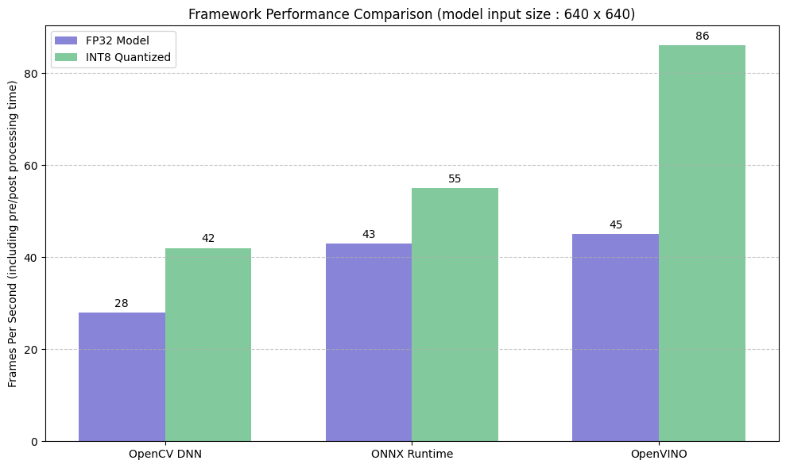

# Fast_YOLOv8_CPP

## Introduction  
This repository contains the code for performing inference on the **YOLOv8n object detection model** in **C++**. The three approaches implemented are:  

1. **OpenCV DNN Module** – The easiest to integrate, supports Intel OpenVINO backend for acceleration.  
2. **ONNX Runtime** – More flexible across different platforms; allows selecting execution providers like **OpenVINO or TensorRT** based on hardware.  
3. **OpenVINO** – Optimized for Intel hardware, delivering the best performance.  

For comparison, I tested all three approaches using **YOLOv8n** object detection with both **FP32 models** and **INT8 static quantization**.  
**OpenVINO proved to be the fastest** on a **12th Gen Intel® Core™ i7-12650H processor**.  

## Usage  
Check out the subfolders for individual implementation instructions:  

- [`opencv_dnn/`](opencv_dnn/) – OpenCV DNN Module.  
- [`onnxruntime/`](onnxruntime/) – ONNX Runtime with OpenVINO Execution Provider.  
- [`openvino/`](openvino/) – Native OpenVINO Inference.  

## Result  
Comparison of inference performance across different approaches:  

  

## Acknowledgment  
- [Ultralytics](https://github.com/ultralytics/ultralytics).  
- [ONNX Runtime Inference](https://github.com/leimao/ONNX-Runtime-Inference).  
